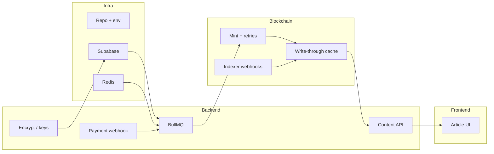

# web3_asset

**Content Assetization Platform (CAP v3.0) — MVP**  
Premium articles as NFT-gated assets: **payment → async mint (BullMQ) → ownership cache (Supabase) → encrypted content access → Canvas UI**.

---

## Overview

This repository implements the **Industrial-Grade Web3 Content Assetization Protocol v3.0** MVP: one premium article flows end-to-end through payment webhooks, queued minting with retries and rate limits, a hybrid **write-through + webhook** ownership model, and holder-only decryption on the client.

| Pillar | Approach |
|--------|----------|
| **Reliable minting** | BullMQ `Mint_Task`; no direct mint from payment; exponential backoff on RPC; **≤5 mint jobs/sec** (queue limiter) |
| **Permission cache** | Supabase `ownership_cache` updated after mint; Alchemy (or similar) Transfer webhooks for secondary sales; batch reconciliation vs chain |
| **Gas** | Lazy mint vouchers and/or multicall batching (MVP demonstrates at least one path) |
| **Content** | Ciphertext in Supabase; keys via signed URLs or Lit (placeholder); decrypt in memory for holders |
| **UX** | Next.js App Router; Canvas display with copy friction; NFT badge; pending mint states |

**Documentation:** [docs index](docs/README.md) · [Delivery playbook (minimal delivery)](docs/DELIVERY_PLAYBOOK.md) · [Architecture rationale & risks](docs/ARCHITECTURE.md) · [MVP sprint plan](docs/MVP_DEVELOPMENT_PLAN.md)

---

## Architecture (target)



**Implementation order:** schema + Redis → queue + mint processor → cache + webhooks → gated content API → frontend E2E → hardening.

---

## Tech stack

| Layer | Choice |
|-------|--------|
| App | **Next.js** (App Router), **React**, **TypeScript**, **Tailwind CSS** |
| Data | **Supabase** (Postgres + auth patterns TBD) |
| Queue | **BullMQ** + **Redis** |
| Chain | **Thirdweb** (`@thirdweb-dev/sdk`), **ethers** v5 (matches SDK peers) |
| Payments / mint triggers | **Crossmint** (webhook contract TBD) |

---

## Repository layout

```
├── scripts/                 # Node scripts (mint worker, queue smoke) — `tsx`
├── src/app/                 # Next.js App Router (pages, layouts, API routes)
├── src/lib/                 # Redis, BullMQ queue, env helpers
├── supabase/
│   ├── config.toml          # Local Supabase CLI (ports may differ if multiple projects run locally)
│   └── migrations/          # SQL migrations (source of truth for schema)
├── docs/
│   ├── README.md                  # Documentation index
│   ├── sprints/                   # Day-by-day sprint logs (Day 1, Day 2, …)
│   ├── DELIVERY_PLAYBOOK.md       # Minimal delivery & health guardrails (stack-specific)
│   ├── ARCHITECTURE.md            # Rationale, risks, mitigations (outbox, DLQ, keys)
│   └── MVP_DEVELOPMENT_PLAN.md    # Two-week MVP roadmap
├── docker-compose.yml       # Redis for local BullMQ
├── .env.example             # Copy to .env / .env.local — never commit secrets
└── package.json
```

---

## Prerequisites

- **Node.js** 20+ (LTS recommended)
- **npm**
- **Docker** (for local Redis; optional for local Supabase via Supabase CLI)
- **Supabase CLI** (`brew install supabase/tap/supabase`) for migrations and local stack

---

## Quick start

```bash
git clone <this-repo>
cd web3_asset
npm install
cp .env.example .env.local   # fill in real values before production
```

**Redis (BullMQ):**

```bash
npm run redis:up    # docker compose up -d
# default: redis://127.0.0.1:6379
npm run redis:down  # stop container
```

**Dev server:**

```bash
npm run dev
# http://localhost:3000
```

**Build:**

```bash
npm run build && npm start
```

---

## Environment variables

See [`.env.example`](.env.example). Minimum for upcoming work:

| Variable | Role |
|----------|------|
| `NEXT_PUBLIC_SUPABASE_URL` / `NEXT_PUBLIC_SUPABASE_ANON_KEY` | Browser-safe Supabase client |
| `SUPABASE_SERVICE_ROLE_KEY` | Server-only (webhooks, admin cache writes) — **never expose to client** |
| `REDIS_URL` | BullMQ connection |
| `THIRDWEB_PRIVATE_KEY` | Backend signer for contract calls |
| `CROSSMINT_WEBHOOK_SECRET` | Verify payment webhooks |

---

## Database (Supabase)

Migrations live under `supabase/migrations/`. Initial tables:

- **`articles`** — title, `encrypted_content`, price, `cover_url`, etc.
- **`orders`** — `payment_id` (unique), status enum, `tx_hash`, FK to `articles`
- **`ownership_cache`** — `owner_address`, `article_id`, `token_id`, `source` (MINT / TRANSFER / SYNC)

**Apply to a hosted project** (after `supabase login`):

```bash
supabase link --project-ref <your-project-ref>
supabase db push
```

**Local Supabase** (optional):

```bash
supabase start
# If another Supabase stack already uses default ports, adjust ports in supabase/config.toml
supabase stop
```

---

## Scripts

| Command | Description |
|---------|-------------|
| `npm run dev` | Next.js development |
| `npm run build` / `npm start` | Production build & serve |
| `npm run lint` | ESLint |
| `npm run redis:up` / `redis:down` | Local Redis via Docker Compose |
| `npm run worker:mint` | BullMQ worker (placeholder mint processor) **+ Redis running** |
| `npm run queue:smoke` | Enqueue one test mint job (requires `worker:mint` in another terminal) |

---

## Roadmap

MVP is scoped to **one premium article** and a **two-week** execution plan. See [`docs/MVP_DEVELOPMENT_PLAN.md`](docs/MVP_DEVELOPMENT_PLAN.md) for milestones, dependencies between frontend/backend/chain, and what can be deferred if time is tight.

Design tradeoffs and production risks (dual writes, mint idempotency, keys, Realtime, DLQ): [`docs/ARCHITECTURE.md`](docs/ARCHITECTURE.md).

---

## Security

- Do not commit `.env`, `.env.local`, or private keys.
- Prefer **service role** only on the server (Route Handlers, workers), never in `NEXT_PUBLIC_*` bundles.
- Rotate webhook secrets and RPC keys if exposed.

---

## License

Private / TBD — set `LICENSE` when the project’s legal terms are finalized.
