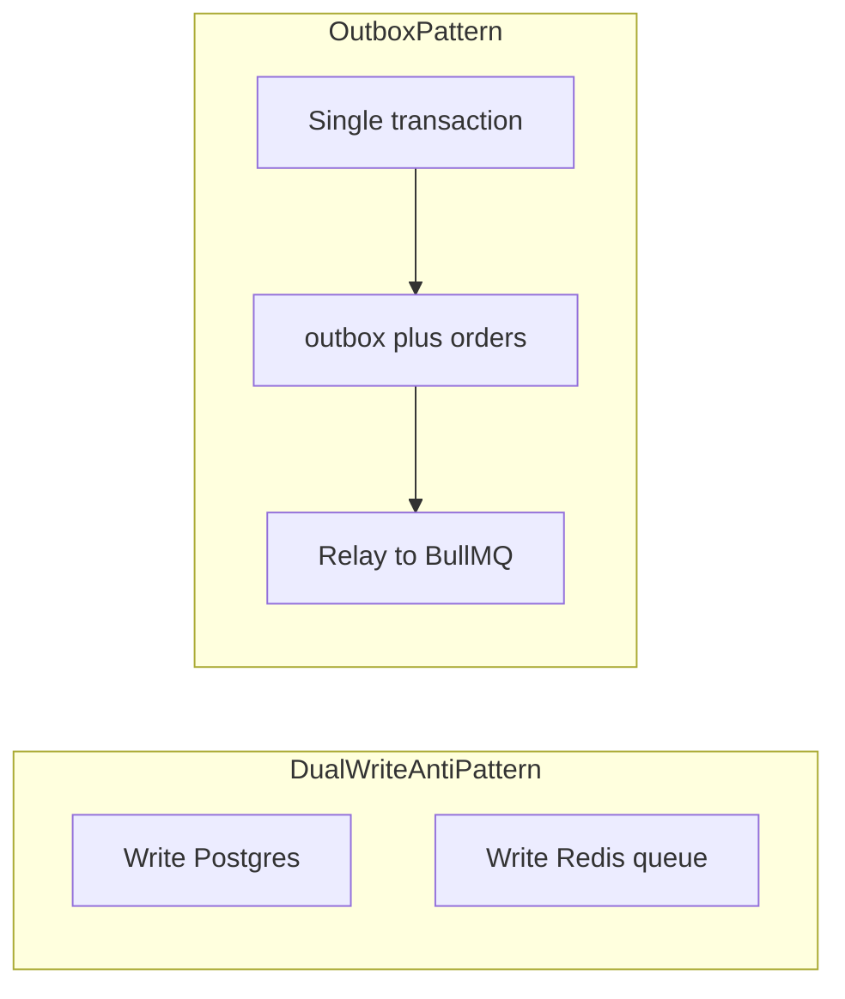

# CAP v3.0 — Architecture rationale and risks

This document captures **why** the stack is shaped as it is, **what can go wrong**, and **how to harden** the system before production. It complements the execution roadmap in [`MVP_DEVELOPMENT_PLAN.md`](MVP_DEVELOPMENT_PLAN.md).

---

## 1. Architectural strengths

### 1.1 BullMQ async decoupling

Payment webhooks must return **fast HTTP 2xx**, be **idempotent**, and tolerate provider retries. On-chain confirmation is slow, failure-prone, and unsuitable to run inside the webhook request lifecycle.

**Queueing mint work** separates:

- **Ingress:** validate signature, persist order state, acknowledge the provider.
- **Processing:** RPC submission, retries, gas/nonce policy, cache updates.

Scalability comes from **horizontally scaling workers** and **per-queue rate limits** (e.g. global mint TPS), not from the queue product alone.

### 1.2 Write-through `ownership_cache`

Indexing and RPC reads lag chain finality. For **read-after-write** UX (user just paid or mint just completed), the UI cannot rely only on delayed indexer state.

Updating **`ownership_cache` in the same logical path as a successful mint** gives the app a fast, queryable source for gating and badges. **Chain state remains the ultimate source of truth**; the cache is an acceleration layer that must be **repaired and reconciled** (see §2.2).

### 1.3 Infrastructure layering

| Layer | Role |
|-------|------|
| **Supabase (Postgres)** | Durable relational state: articles, orders, ownership cache, future outbox tables. |
| **Redis** | BullMQ backing store: job lifecycle, retries, scheduling — not the system of record for business entities. |

Clarification: Redis is **queue infrastructure**, not a general-purpose replacement for Postgres for orders or permissions.

---

## 2. Risks and mitigations

### 2.1 Dual writes: DB vs queue

**Risk:** `orders` row committed in Postgres, but **enqueue to BullMQ fails** (Redis unavailable, transient error). User may appear “paid” while no mint job runs.

**Mitigations (in order of robustness):**

1. **Transactional outbox (recommended for production):** In one Postgres transaction, insert/update `orders` and append a row to `outbox_mint_jobs` (or similar). A separate **relay process** polls or listens and pushes to BullMQ, marking outbox rows as delivered. Single write path to the database of record.

2. **Minimum viable:** If enqueue fails, keep `orders.status` in a **retryable** state, store `last_enqueue_error`, and rely on **webhook idempotency** (same `payment_id`) or a **scheduled sweeper** that re-enqueues pending rows.

3. **Redis AOF:** Reduces **loss of already accepted queue state** after crashes. It does **not** fix application-level “only one side written” bugs. Treat AOF as infra durability, not a substitute for outbox.

### 2.2 Mint worker idempotency and chain retries

**Risk:** Blind retries can **mint twice**, waste gas, or leave inconsistent `orders` / `token_id` mapping.

**Mitigations:**

- **Idempotent job key:** `payment_id` or `order_id` uniquely identifies at-most-one successful mint; DB constraints enforce it.
- **Worker semantics:** Before sending a transaction, transition order to **`PROCESSING`** with a lease or version column; on success set **`COMPLETED`** + `tx_hash` + `token_id`; on deterministic revert, **`FAILED`** with reason.
- **Nonce policy:** Prefer **sequential signing** from a single hot wallet per chain, or explicit nonce management — avoid parallel workers racing the same signer without coordination.
- **Chain-level guard:** Contract or metadata ties mint to `payment_id` / `order_id` so duplicate submissions revert or no-op.

### 2.3 Key and secret management

**Risk:** Leaked `THIRDWEB_PRIVATE_KEY`, webhook secrets, or content encryption keys compromise funds and content.

**Mitigations:**

- **Production:** Store secrets in **AWS KMS**, **GCP Secret Manager**, **HashiCorp Vault**, or equivalent; inject at runtime; rotate on incident.
- **MPC / HSM:** Justified for high-value custodial flows; higher integration cost — typically **not** MVP unless requirements demand it.
- **Threat model:** Document whether the **server can decrypt content** (envelope encryption) vs **client-only / Lit** — UX and compliance implications differ.

### 2.4 Cache vs chain drift

**Risk:** `ownership_cache` diverges from chain (missed webhook, bug, reorg edge case).

**Mitigations:**

- **Indexer webhooks** (e.g. Transfer) for secondary-market updates.
- **Scheduled reconciliation:** Compare cache to `ownerOf` / indexer for affected `token_id`s; alert on mismatch.

---

## 3. UX and operations

### 3.1 Live UI without polling

Blockchain steps are slow. Prefer **push updates** to the article UI:

- **Supabase Realtime** subscriptions on `orders` and/or `ownership_cache` for the current user or article.
- Alternatively **SSE** from a Route Handler if you centralize fan-out server-side.

The client still shows honest states: **paid → queued → processing → completed / failed / needs support**.

### 3.2 Dead letters and observability

BullMQ **failed jobs** are the practical **dead-letter surface**. Production needs:

- **Max attempts** and **backoff** policy per job type.
- **Structured logs** with `payment_id`, `order_id`, `job_id`, `tx_hash`.
- **Alerting** on DLQ depth, error rate spikes, or repeated RPC errors.
- **Admin surface:** List orders stuck in `FAILED` or jobs exhausted after max retries for **manual intervention** (refund, replay, support).

---

## 4. Related documents

| Document | Purpose |
|----------|---------|
| [Repository `README.md`](../README.md) | Repo overview, stack, quick start |
| [`docs/README.md`](README.md) | Index of all docs in this folder |
| [`DELIVERY_PLAYBOOK.md`](DELIVERY_PLAYBOOK.md) | Minimal delivery gate, stack defaults, UI purity |
| [`MVP_DEVELOPMENT_PLAN.md`](MVP_DEVELOPMENT_PLAN.md) | Day-by-day MVP sprint |

---

## 5. Revision history

| Date | Note |
|------|------|
| 2026-04-06 | Initial architecture rationale and risk register |
