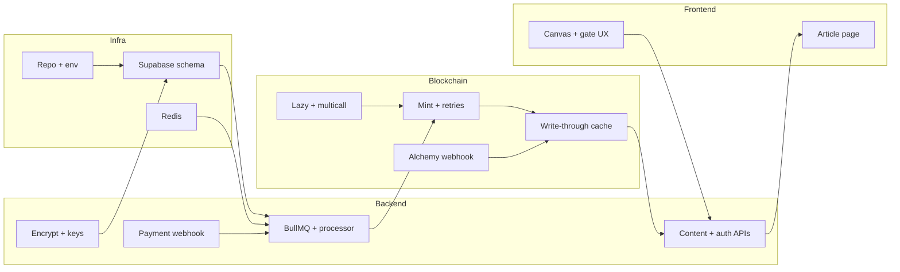

# Web3.5 Content Assetization Platform — MVP Development Plan

**Version:** Industrial-Grade Web3 Content Assetization Protocol v3.0 (MVP)  
**Sprint length:** 2 weeks  
**Team:** Frontend + Backend + Blockchain  

**Related:** [Architecture rationale & risks](ARCHITECTURE.md) · [Documentation index](README.md)

This document is a **day-by-day, dependency-aware roadmap** for shipping one premium article end-to-end: payment → mint queue → ownership cache → content gate → frontend display.

---

## 1. MVP scope (non-negotiable)

| Area | MVP commitment |
|------|----------------|
| **Minting** | BullMQ `Mint_Task`; payment triggers queue (not direct chain call); exponential backoff on RPC failure; **5 mint requests/sec** global limiter |
| **Permission** | Write-through `ownership_cache` after mint; Alchemy webhook for Transfer (secondary); daily batch reconciliation script |
| **Gas** | Lazy mint (vouchers) and/or multicall batching (at least one path demonstrable) |
| **Content** | Encrypted `articles` in Supabase; decryption for NFT holders only; keys via signed URLs or Lit placeholder |
| **Frontend** | Canvas rendering (copy friction); NFT ownership badge; pending mint loading states |

**Single-article MVP:** one premium article fully wired through the stack.

---

## 2. Work-stream dependencies

**Rule:** Infra + schema → queue + mint → cache + webhooks → content API + crypto → UI for the happy path; then hardening + QA.

---

## 3. Team ownership (lightweight)

| Stream | Primary focus |
|--------|----------------|
| **Backend** | BullMQ, webhooks, Supabase, APIs, encryption plumbing, reconciliation |
| **Blockchain** | Thirdweb / contract config, RPC resilience, lazy vouchers, multicall, Alchemy filters |
| **Frontend** | Article page, Canvas, ownership badge, pending mint UX |

Blockchain + backend pair closely on **Days 4–6**; all three align on **Days 9–10** (E2E).

---

## 4. Day-by-day plan

### Day 1 — Project setup and architecture

**Objective:** Runnable repo, secrets pattern, database matching MVP.

| Task | Owner | Done when |
|------|--------|-----------|
| Scaffold monorepo (e.g. `apps/web`, `apps/api`, shared `packages/types`) | All | CI runs lint/test |
| Supabase: `articles`, `orders`, `ownership_cache` + indexes + RLS stub (service role server-side) | BE | Migrations apply locally |
| Redis (Docker Compose or cloud dev) | BE | Connection works |
| `.env.example`: Supabase, Redis, RPC, Crossmint secret, Thirdweb, Alchemy webhook | All | Documented |

**Dependencies:** Redis + Supabase unblock Day 2.  

**Milestone M1:** App connects to DB and Redis.

---

### Day 2 — BullMQ queue skeleton

**Objective:** Job lifecycle before chain logic.

| Task | Owner | Done when |
|------|--------|-----------|
| `Mint_Task` queue + stalled/DLQ settings | BE | Jobs survive API restart |
| Placeholder processor (log payload, fake success) | BE | Worker runs (Docker/PM2) |
| Enqueue smoke (script or admin route) | BE | Repeatable local test |

**Dependencies:** Day 1 Redis. No chain yet.  

**Milestone M2:** Enqueue → process → ack is reliable.

---

### Day 3 — Payment webhook → queue

**Objective:** Payment is the **only** mint trigger.

| Task | Owner | Done when |
|------|--------|-----------|
| `POST /api/webhooks/crossmint` (or provider): validate secret/signature | BE | 401 on bad secret |
| Map payload → `{ user_address, article_id, payment_id }` → enqueue with **idempotency** on `payment_id` | BE | No double-mint on duplicate webhooks |
| Upsert `orders`: `PENDING`, link `payment_id` | BE | Queryable |
| Mock webhook tests | BE | CI green |

**Dependencies:** Day 2 queue + Day 1 `orders`.  

**Risk:** Idempotency before real money.

---

### Day 4 — NFT minting in worker

**Objective:** Real mint with retries and throughput cap.

| Task | Owner | Done when |
|------|--------|-----------|
| Thirdweb `mintTo` (or equivalent) in processor | Chain + BE | Testnet tx succeeds |
| Exponential backoff on RPC; max attempts + DLQ | BE | Failures visible |
| BullMQ **limiter: max 5 jobs/sec** on mint queue | BE | Verified under burst |
| Success: `orders.status = COMPLETED`, `tx_hash` | BE | DB matches chain |
| Failure: `orders.status = FAILED` + reason | BE | Supportable |

**Dependencies:** Day 3 payload shape; funded deployer on testnet.  

**Milestone M3:** Webhook → queue → confirmed tx → order complete.

---

### Day 5 — Ownership cache and Alchemy

**Objective:** Write-through + webhook compensation.

| Task | Owner | Done when |
|------|--------|-----------|
| After mint: upsert `ownership_cache` (owner, `article_id`, `token_id`, `last_update`, source=`mint`) | BE + Chain | One-article path works |
| Alchemy Notify: Transfer; verify; map `to` + `tokenId` → cache | Chain + BE | Secondary updates cache |
| Reconciliation script: cache vs RPC for MVP token range | BE | Mismatches reported |

**Dependencies:** Day 4 emits real `token_id`; Alchemy needs contract + topics.  

**Milestone M4:** Mint and secondary transfer both in Supabase.

---

### Day 6 — Lazy mint and multicall

**Objective:** Gas story without blocking main demo.

| Task | Owner | Done when |
|------|--------|-----------|
| Server-signed voucher (EIP-712 / Thirdweb lazy mint) | Chain | Verifiable |
| First-read: either batch enqueue mint **or** voucher + “confirm mint” (choose one for MVP) | BE + FE | Documented |
| Multicall: batch ≥2 pending mints in one tx | Chain | Gas savings on explorer |

**Dependencies:** Days 4–5 stable.  

**Slip strategy:** If needed, ship **lazy XOR multicall**; keep queue + write-through.

---

### Day 7 — Backend content access

**Objective:** Gate by NFT: cache first, chain fallback.

| Task | Owner | Done when |
|------|--------|-----------|
| `/api/get-article-content` (or GET/POST): wallet/session auth | BE | Abuse-resistant |
| Check `ownership_cache`; on miss, `ownerOf` + refresh cache | BE + Chain | Holder gets content |
| Return ciphertext envelope only; never log plaintext | BE | Audit-friendly |

**Dependencies:** Day 5 cache.

---

### Day 8 — Content encryption

**Objective:** Encrypted at rest; keys only for entitled clients.

| Task | Owner | Done when |
|------|--------|-----------|
| Encrypt `articles.encrypted_body` (AES-GCM or libsodium); IV + version | BE | One row in Supabase |
| Key distribution: signed URL **or** Lit stub (feature flag) | BE | Decrypt in Node test |
| Document MVP stance (server vs client-only decrypt) | All | Agreed |

**Dependencies:** Day 1 `articles`; Day 7 response shape.

---

### Day 9 — Frontend MVP

**Objective:** Canvas, badge, pending mint.

| Task | Owner | Done when |
|------|--------|-----------|
| Fetch + decrypt in memory (Web Crypto) | FE | Minimal plaintext retention |
| Canvas render; copy/context menu friction | FE | Matches spec |
| Badge: address + `tokenId`; pending from `orders` | FE | Clear states |
| Loading animation for queued/processing mint | FE | Matches queue states |

**Dependencies:** Days 7–8 APIs + sample encrypted article.

---

### Day 10 — End-to-end integration

**Objective:** Full path on testnet; races fixed.

| Task | Owner | Done when |
|------|--------|-----------|
| E2E: pay → webhook → queue → mint → cache → decrypt → Canvas | All | Checklist pass |
| Edge cases: duplicate webhook, slow RPC, transfer before first load | BE + Chain | Documented |

**Milestone M5:** MVP feature-complete for one article.

---

### Day 11 — Error handling and logging

**Objective:** Observable queue and webhooks.

| Task | Owner | Done when |
|------|--------|-----------|
| Structured logs: `payment_id`, `jobId`, `tx_hash`, `article_id` | BE | Correlation IDs |
| Alerts: DLQ depth, RPC failures (Slack/email) | BE | On-call signal |
| UI: failed mint messaging (no infinite spinner) | FE | User clarity |

---

### Day 12 — Security and access control

**Objective:** Minimum public-URL bar.

| Task | Owner | Done when |
|------|--------|-----------|
| Rate limit webhooks + content API; CORS | BE | Prod config |
| Wallet signatures + short-lived nonces if applicable | BE | Replay resistance |
| Supabase RLS review: no accidental key/ciphertext leaks | BE | Reviewed |

---

### Day 13 — Performance and load

**Objective:** Validate limiter and cache hot path.

| Task | Owner | Done when |
|------|--------|-----------|
| Burst enqueue ~50 jobs; limiter + no duplicate mints | BE | Metrics captured |
| Cache behavior + reconciliation under read load | BE | Recorded |
| Canvas perf with long article | FE | Acceptable on mid devices |

---

### Day 14 — Final QA and deployment prep

**Objective:** Repeatable demo + handoff.

| Task | Owner | Done when |
|------|--------|-----------|
| Full E2E on testnet + known issues list | All | README section |
| Deploy: API + worker + Redis + Supabase; secrets in vault | BE | Staging URL |
| One-page stakeholder flow (diagram: pay → queue → mint → gate) | All | Shared doc |

**Milestone M6:** Demo-ready on testnet.

---

## 5. Dependency matrix (if X slips…)

| Slip | Impact |
|------|--------|
| Day 1 schema | Blocks all downstream |
| Days 2–4 queue + mint | Blocks cache, proofs, UI truth |
| Day 5 cache + Alchemy | Wrong permissions for secondary |
| Days 7–8 API + crypto | Frontend cannot be real |
| Day 10 E2E | Parts without integrated product |

---

## 6. MVP cuts (only if required)

**Do not cut:** BullMQ + retries + 5/sec limiter, write-through cache, payment idempotency, basic encryption + holder check, Canvas + badge + pending state.

**May defer:** Full multicall at scale (keep 2-in-1 demo), Lit (signed URLs only), automated daily reconcile (manual script).

---

## 7. Deliverables (end of week 2)

1. One premium article: payment → `Mint_Task` → tx → `orders` + `ownership_cache` → gated decrypt → Canvas.  
2. BullMQ: backoff, concurrency limit, DLQ visibility.  
3. Supabase `ownership_cache` + mint write-through + Alchemy Transfer handling + batch reconciliation script.  
4. Lazy mint and/or multicall demonstrated (documented path).  
5. Encrypted storage + holder-only decryption.  
6. Frontend: Canvas, ownership proof, pending mint animation.

---

## 8. Document history

| Version | Date | Notes |
|---------|------|--------|
| 1.0 | 2026-04-05 | Initial MVP 2-week roadmap |
